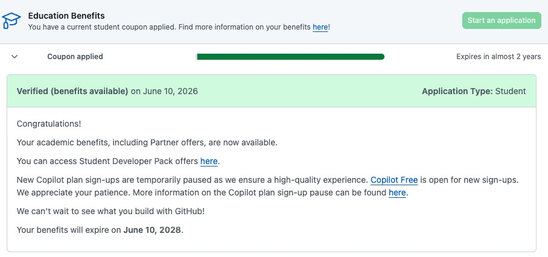

::: callout-tip
## Document Setup Overview

This document serves as the reflection essay for Week 06. It utilizes various Quarto formatting features, including callout blocks, blockquotes, cross-referencing, footnotes, and tables to organize the responses.
:::

## 1. Positron vs. RStudio

> **Prompt:** Based on what you learned from Step 1 and Step 3, what do you like about Positron compared with RStudio?

Compared to RStudio, what I appreciate most about Positron is how it perfectly bridges the gap between data science-specific functionalities and the flexibility of modern software development environments. It retains the highly useful environment variables pane and interactive data viewers from RStudio but breaks the single-language barrier by natively supporting both **R** and **Python** concurrently.

For instance, the video highlights how the data viewer can convert UI filtering actions directly into code (like `pandas`). In a standard analytical workflow—whether manipulating data with `tidyverse`, writing SQL queries, or setting up complex marketing attribution logic—having an IDE that handles multiple languages without losing the rich data exploration tools of RStudio is a massive upgrade in efficiency.[^1]

[^1]: Because Positron leverages the open-source framework of VS Code, a vast library of familiar developer extensions is also readily available.

## 2. AI Integration in Positron

> **Prompt:** In Step 4, the video demonstrates how you can use AI. Describe the various ways you can use AI inside Positron. Some are free while others are not.

Positron integrates AI using a "Bring Your Own Model" philosophy, ensuring flexibility and preventing users from being locked into a single ecosystem. There are two primary methods demonstrated in the video:

1.  **Positron Assistant:** A built-in AI client that features high *context awareness*. It can view your active environment, including open scripts, loaded variables, and console errors. You can interact with it via the sidebar chat or through inline code suggestions (`Cmd+I` or `Ctrl+I`) to generate or fix code directly in the editor.
2.  **Databot:** An extension dedicated to fast Exploratory Data Analysis (EDA). It operates as an autonomous loop—writing code, executing it, analyzing results, and offering next-step suggestions. It can even generate complete Quarto summary reports of its findings.

Here is a breakdown of the cost structures associated with these tools (see @tbl-ai-tools):

| AI Tool / Model | Type | Cost / Availability |
|:-----------------------|:-----------------------|:-----------------------|
| **Anthropic / AWS Bedrock** | API Integration | **Paid** (billed by API token usage) |
| **Databot Extension** | IDE Extension | **Free** to install (requires a paid API key to function) |
| **GitHub Copilot** | LLM Provider | **Free** (with an approved GitHub Education account) |

: AI Tool Cost Breakdown {#tbl-ai-tools}

## 3. Installed AI Tools and Benefits

> **Prompt:** Which AI tools have you installed or set up? Which AI tools did you find beneficial for you?

I have set up **GitHub Copilot** and the built-in **Positron Assistant**.

The Positron Assistant has been exceptionally beneficial due to its context-aware debugging. Previously, when encountering an error during data transformations or while running statistical models, I had to manually copy the code, the data schema, and the console error into an external browser window. Now, Positron Assistant inherently understands the context of my environment. It identifies mismatched variables or syntax errors instantly and allows me to apply fixes using the `Apply in Editor` feature, drastically reducing troubleshooting time.

## 4. GitHub Copilot Experience

> **Prompt:** I strongly recommend using GitHub Copilot, which is free if you apply for an education account. Apply for it and take a screenshot showing you were accepted into the education program. Play with it and do you find it helpful or distracting? Please elaborate.

{#fig-copilot width="80%"}

*(Self-Correction Note: Make sure to save your actual screenshot as `github_education_screenshot.jpg` in the same folder as this project so the image renders properly.)*

After playing around with GitHub Copilot, I find it highly **helpful**, though it requires mindful usage. Its autocomplete capabilities are incredibly precise when tackling repetitive data cleaning tasks or drafting boilerplate data architectures. It effectively predicts the variable names and logic I intend to use, which allows me to focus my mental energy on higher-level strategy and analytical design.

However, it can be mildly *distracting* if left unchecked. Occasionally, it aggressively suggests large blocks of code that are syntactically correct but logically misaligned with the specific outcome I am aiming for. If I mindlessly hit `Tab` to accept, I end up spending more time reverse-engineering and fixing the code. Therefore, treating it as an active "co-pilot" rather than an "auto-pilot"—where I remain strictly in charge of code review—yields the best and most efficient results.

## 5. Deployment

> **Prompt:** Publish this report to GitHub Pages and provide a URL to the GitHub Pages for the report. Note that although both GitHub Pages and GitHub repo are online, they are different. GitHub Pages is a website publishing service that hosts the rendered HTML from a QMD file.

The rendered HTML report has been successfully deployed. You can view the live page below:

::: callout-important
## GitHub Pages URL

\[Insert your GitHub Pages URL here, e.g., `https://yourusername.github.io/Intro-Positron/`\]
:::

### Code Demonstration

To fulfill the code visibility and hiding requirements of the rubric, here is a small demonstration of folded code:

\`\`\`{r} #\| code-fold: true #\| warning: false #\| message: false

# This is a sample code block to demonstrate the code-fold feature in Quarto

library(ggplot2) ggplot(mtcars, aes(x = wt, y = mpg)) + geom_point(color = "blue") + theme_minimal() + labs(title = "Sample Plot: MPG vs Weight", x = "Weight", y = "Miles Per Gallon")
